# Nvidia AI Specialist CertificationğŸ‹ï¸â€â™‚ï¸

# 프로ì íŠ¸ 개요(**Overview of the Project)**

- **배경 정보 소개(Backgrounds of project)**
- **프로ì íŠ¸ì˜ ì „ë°˜ì  ë‚´ìš©(General description of the current project)**
- **제안하는 프로ì íŠ¸ì˜ ê°•ì 
(Proposed idea for enhancements to the project)**
- **프로ì íŠ¸ì˜ 가치(Value and significance of this project)**
- **ì§ë©´í•˜ê³  ìˆëŠ” 한계(Current limitations)**
- **결과물(Results)**

# **ğŸ‹ï¸â€â™‚ï¸**  프로ì íŠ¸ 주제 (Title) **ğŸ‹ï¸â€â™‚ï¸**

## **YOLOV5를 ì´ìš©í•œ 피트니스 소ë„구 íŒë³„**

---

## **Fitness Equipment Identification Using YOLOV5**

# ë°°ê²½ ì •ë³´

   **Background information**

---

<aside>
**ì´ í”„ë¡œì íŠ¸ë¥¼ 통해 ê³ ê°ì€ 피트니스 ì†Œí’ˆì˜ ì •í™•í•œ ì´ë¦„ê³¼ ìš©ë„를 파악할 수 ìˆìŠµë‹ˆë‹¤**

**ì‚¬ë¬¼ì„ ë‹¤ë¥´ê²Œ ì¸ì‹í•˜ëŠ” ë° ë„ì›€ì´ ë˜ëŠ” YOLOv5 기반 사물 ì¸ì‹ 모ë¸**

**ì†Œí’ˆì„ ì‚¬ìš©í•˜ì—¬ 실시간으로 ì†Œí’ˆì„ ì¸ì‹í•˜ê³  ì†Œí’ˆì˜ ì´ë¦„ì„ ì•Œë ¤ì£¼ëŠ” 시스템**

**ê±´ì¶•ì— ê´€í•œ 것ì…니다. ê³ ê°ì€ ì¹´ë©”ë¼ ì•ì— 다양한 ì†Œí’ˆì„ ê°€ì ¸ì˜µë‹ˆë‹¤**

**대면하여 ì‹œìŠ¤í…œì´ ì´ë¥¼ ì¸ì‹í•˜ê³  ë„êµ¬ì˜ ì´ë¦„ê³¼ ìš©ë„를 즉시 알려ì¤ë‹ˆë‹¤**

**ìš´ë™ ë„구와 ìš´ë™ íš¨ê³¼ì— ëŒ€í•´ ìì„¸íˆ ì•Œì•„ë³´ê¸° 위해 ê³ ê°ì—게 제공합니다**

**ë¹„ìœ¨ì„ ë†’ì´ê³  올바른 ë„구 사용 ë°©ë²•ì„ ë°°ìš¸ 수 ìˆìŠµë‹ˆë‹¤.**

</aside>

---

This project aims to build a system that uses a YOLOv5-based object recognition model to identify fitness accessories in real-time and provide their names, helping customers quickly recognize the correct names and purposes of these items. When customers present various accessories in front of the camera, the system recognizes them and immediately provides the name and purpose of each tool. Through this, customers can learn more about exercise equipment, increase their workout efficiency, and learn the correct ways to use the tools.

---

# 프로ì íŠ¸ì˜ ì „ë°˜ì  ì„¤ëª…

  **General description of the current project**

---

<aside>
ğŸ‹ï¸ **ìš´ë™ ì¤‘ì—는 다양한 소ë„êµ¬ë“¤ì´ ì‚¬ìš©ë˜ì§€ë§Œ, ë§ì€ ê³ ê°ë“¤ì´ ì´ ì†Œë„êµ¬ë“¤ì˜ ì´ë¦„ì„ ì •í™•íˆ ì¸ì‹í•˜ì§€ 못하는 경우가 ë§ë‹¤. 케틀벨, 요가 블ë¡, ë¼í¬ë¡œìŠ¤ ë³¼, í¼ ë¡¤ëŸ¬ 등 ê°ê¸° 다른 소ë„êµ¬ë“¤ì€ ê°ê°ì˜ ìš´ë™ì— ë§ëŠ” 중요한 ì—­í• ì„ í•œë‹¤. 하지만 ì´ ë„êµ¬ë“¤ì˜ ì •í™•í•œ ëª…ì¹­ì„ ëª¨ë¥´ê±°ë‚˜ 혼ë™í•˜ëŠ” 경우가 ì주 ë°œìƒí•œë‹¤. ì´ë¡œ ì¸í•´ ê³ ê°ë“¤ì€ ìš´ë™ ì¤‘ì— ì–´ë–¤ ë„구를 사용해야 하는지, 어떻게 활용해야 하는 ì§€ì— ëŒ€í•œ 혼ë€ì„ 겪고 ìˆë‹¤. ë˜í•œ, ì´ë¦„ì„ ëª°ë¼ ì œëŒ€ë¡œ ëœ ì •ë³´ë¥¼ 찾기 위해 추가ì ì¸ ê²€ìƒ‰ì„ í•´ì•¼ 하거나, 올바른 ë„구를 ì„ íƒí•˜ëŠ” ë° ì‹œê°„ì´ ë‚­ë¹„ë˜ê³¤ í•˜ê¸°ì— ì´ë¥¼ 방지하여 소ë„구를 실시간으로 ì¸ì‹í•˜ê³  트레ì´ë‹ì— 실용ì ì¸ 정보를 제공한다.**

</aside>

---

Various accessories are used during exercise, but many customers often fail to accurately recognize the names of these accessories. Different tools such as kettlebells, yoga blocks, lacrosse balls, and foam rollers each play important roles in specific exercises. However, people frequently don't know or confuse the exact names of these tools. As a result, customers experience confusion about which tools to use during workouts and how to utilize them. Additionally, not knowing the names often leads to the need for additional searches to find proper information or wasted time in selecting the right tool. To prevent this, we provide real-time recognition of accessories and practical training information.

# 제안하고 ì‹¶ì€ í”„ë¡œì íŠ¸ì˜ ê°•ì 

 **Proposed idea for enhancements to the project**     

---

---

- **효율ì ì¸ 학습:** 
ê³ ê°ë“¤ì€ ì§ì ‘ 검색하지 ì•Šê³ ë„ ì‹¤ì‹œê°„ìœ¼ë¡œ ë„êµ¬ì— ëŒ€í•œ 정보를 ì–»ì„ ìˆ˜ ìˆì–´ 학습 ì†ë„ ì¦ê°€
- **사용ì 경험 í–¥ìƒ:** 
ìš´ë™ ì¤‘ 사용ë˜ëŠ” ë„구를 바로 ì¸ì‹í•  수 ìˆì–´ ë” ì´ìƒ í˜¼ë™ ì—†ì´ ìš´ë™ì— 집중하는 환경 제공
- **ìš´ë™ íš¨ê³¼ 극대화:** 
올바른 ë„구를 정확하게 사용할 수 ìˆì–´, ìš´ë™ íš¨ê³¼ë¥¼ 극대화하고 ë¶€ìƒ ìœ„í—˜ ê°ì†Œ
- **기술과 ìš´ë™ì˜ 융합:** 
최신 AI ê¸°ìˆ ì„ í™œìš©í•˜ì—¬ ìš´ë™ê³¼ í•™ìŠµì„ ë™ì‹œì— í•  수 ìˆëŠ” í™˜ê²½ì„ ì œê³µí•¨ìœ¼ë¡œì¨, 보다 스마트한 ìš´ë™ ê²½í—˜ 제공
    
    실제로 PT샵과 ê°™ì€ ê³³ì€ ë³´ì—¬ì§€ëŠ” 것과 ì„œë¹„ìŠ¤ì œê³µì´ ì¤‘ìš”í•˜ê¸°ì— ì¶©ë¶„í•œ ê²½ìŸë ¥ê³¼ í¸ë¦¬í•¨ 제공(**In fact, places like PT shops offer enough competitiveness and convenience for what they see and what they serve to be important)**
    
- **트레ì´ë„ˆì™€ ê³ ê° ê°„ì˜ ì†Œí†µ ê°•í™”:** 
트레ì´ë„ˆëŠ” ê³ ê°ë“¤ì´ ë„구를 올바르게 사용할 수 ìˆë„ë¡ ë„와줄 수 ìˆìœ¼ë©°, ì´ ì‹œìŠ¤í…œì„ í†µí•´ ê³ ê°ê³¼ ì›í™œí•œ 소통 통한 ë” ë‚˜ì€ í”¼ë“œë°± 제공

---

- **Efficient learning: Customers can obtain real-time information about tools without direct searching, increasing the speed of learning**
- **Enhanced user experience: Providing an environment where users can focus on exercising without confusion by instantly recognizing tools used during workouts**
- **Maximizing exercise effectiveness: Ability to use the correct tools accurately, maximizing exercise effects and reducing the risk of injury**
- **Integration of technology and exercise: Providing a smarter exercise experience by offering an environment where users can exercise and learn simultaneously using the latest AI technologyIn fact, places like PT shops provide sufficient competitiveness and convenience as the visual aspect and service provision are important**
- **Strengthening communication between trainers and clients: Trainers can help clients use tools correctly, and through this system, provide better feedback through smooth communication with clients**

---

# 프로ì íŠ¸ì˜ 가치와 중요성

 **Value and significance of the project**

<aside>
ğŸ‹ï¸ **ì´ í”„ë¡œì íŠ¸ëŠ” 피트니스 소ë„구를 실시간으로 ì¸ì‹í•˜ê³  ê·¸ ì´ë¦„ê³¼ ì‚¬ìš©ë²•ì„ ì•Œë ¤ì£¼ëŠ” AI 시스템으로 ë§ì€ ê³ ê°ë“¤ì´ ìš´ë™ ë„êµ¬ì˜ ì´ë¦„ì´ë‚˜ ì‚¬ìš©ë²•ì„ ì˜ ëª°ë¼ ë¹„íš¨ìœ¨ì ìœ¼ë¡œ 학습하거나 부ìƒì„ ì´ˆë˜í•  수 ìˆë‹¤.

ì´ ì‹œìŠ¤í…œì€ ì´ë¥¼ 해결하고, ê³ ê°ì´ ë„구를 빠르고 정확하게 ì¸ì‹í•´ ìš´ë™ íš¨ê³¼ë¥¼ 극대화하고 부ìƒì„ 방지하ë„ë¡ ë„ìš°ë©° YOLOv5를 활용해 ë„구를 실시간으로 ì¸ì‹í•˜ê³ , 트레ì´ë„ˆì™€ ê³ ê° ê°„ ì†Œí†µì„ ì›í™œí•˜ê²Œ 만들어 ë” ì•ˆì „í•˜ê³  효율ì ì¸ ìš´ë™ í™˜ê²½ì„ ì œê³µí•œë‹¤.**

</aside>

---

**This project is an AI system that recognizes fitness accessories in real-time and provides their names and usage instructions. Many customers may learn inefficiently or risk injury due to lack of knowledge about the names or proper use of exercise equipment.**

**This system aims to solve this issue by helping customers quickly and accurately recognize tools, maximizing exercise effectiveness and preventing injuries. By utilizing YOLOv5 to recognize tools in real-time, it facilitates smoother communication between trainers and customers, providing a safer and more efficient exercise environment.**

# 한계ì 

**Current limitations**

---

<aside>
ğŸ‹ï¸ **ì´ ì‹œìŠ¤í…œì€ í”¼íŠ¸ë‹ˆìŠ¤ 소ë„구를 실시간으로 ì¸ì‹í•˜ì—¬ ê°œì¸ ë§ì¶¤í˜• ìš´ë™ íŠ¸ë˜í‚¹ 정보를 제공하지만, 모든 ìš´ë™ì„ 완벽하게 ê°œì¸í™”하는 ë°ì—는 한계가 ì¡´ì¬í•œë‹¤. 소ë„êµ¬ì˜ ë¸Œëœë“œë‚˜ ì œì¡°ì‚¬ì— ë”°ë¼ ë””ìì¸, 색ìƒ, í¬ê¸° ë“±ì´ ë‹¤ì–‘í•˜ê¸° ë•Œë¬¸ì— ë™ì¼í•œ ë„구ë¼ë„ ì¸ì‹ì´ 어려운 경우가 ë°œìƒí•  수 ìˆë‹¤. ì´ëŠ” 다양한 소ë„êµ¬ì˜ ë³€í˜•ëœ í˜•íƒœë‚˜ ìƒ‰ìƒ ì°¨ì´ì— ì˜í•´ 완벽한 ì¸ì‹ì´ í˜ë“¤ë‹¤ëŠ” 현실ì ì¸ ë„ì „ 과제ì´ì§€ë§Œ.지ì†ì ì¸ ê°œì„ ì„ í†µí•´ ì ì°¨ ë” ë†’ì€ ì¸ì‹ë¥ ì„ 목표로 하고 ìˆë‹¤.**

</aside>

---

**This system provides real-time recognition of fitness accessories and personalized exercise tracking information, but there are limitations in perfectly personalizing all exercises. Due to the variety in design, color, and size depending on the brand or manufacturer of accessories, there may be cases where even identical tools are difficult to recognize. This presents a realistic challenge in achieving perfect recognition due to the varied forms and color differences of diverse accessories. However, we aim for gradually higher recognition rates through continuous improvements.**

# 문헌 고찰

 **Literature review**

---

<aside>
ğŸ‹ï¸ 1.ë¼ì´ë‹¤ì™€ ì¹´ë©”ë¼ì˜ 한계와 Yolov5를 활용한 ê°ì²´ ê°ì§€ ë° ì¶”ì  ê¸°ìˆ ì— ëŒ€í•œ ì„ í–‰ 연구를 통해 ì´ í”„ë¡œì íŠ¸ì˜ ê¸°ìˆ ì  ë°°ê²½ì„ ì¶©ë¶„í•œ íŒŒì•…ì´ í•„ìš”í•˜ë‹¤.
2.ê¼¬ê¹”ì½˜ì— ëŒ€í•œ 다양한 학습 ë°ì´í„°ì™€ ì¸ê³µì§€ëŠ¥ 학습: ì´ë¯¸ì§€ ì¸ì‹ , ê°ì²´ íƒì§€ ë° ë¶„ë¥˜ì— ëŒ€í•œ 다양한 ì´í•´ê°€ 필요하다.

</aside>

---

- **It is essential to gain a thorough understanding of the limitations of LiDAR and cameras, as well as the technical background of object detection and tracking using YOLOv5 through prior research, to adequately grasp the technological context of this project.**
- **Diverse training data for traffic signals and artificial intelligence training: A comprehensive understanding of image recognition, object detection, and classification is necessary for this project.**

# ì˜ìƒ ì·¨ë“ ë°©ë²•**(Image Acquisition Method)**:

---

- **ì¸ê³µì§€ëŠ¥ ì˜ìƒ ì·¨ë“ : ì§ì ‘ ì¼í•˜ëŠ” ê³³ì—ì„œ ê°ì¢… 소ë„êµ¬ë“¤ì„ ì´¬ì˜**
(Filmed various props at the place where I work)

[https://drive.google.com/file/d/12TG2KZcvgloyKzglvqSZP8Uu5N6jdAa2/view?usp=drive_link](https://drive.google.com/file/d/12TG2KZcvgloyKzglvqSZP8Uu5N6jdAa2/view?usp=drive_link)

**해당 ì˜ìƒì„ ì´ìš©í•˜ì—¬ DarkLabelì—ì„œ ë¼ë²¨ë§ì„ 통한 추출**
(Use this video to extract from DarkLabel through labeling)

# **DarkLabelì„ ì´ìš©í•œ ì˜ìƒ Labeling ë° Innotation**

---

- **ë°ì´í„° 추출: 수집한 ì˜ìƒì„ DarkLabel ì—ì„œ ì´ë¯¸ì§€ë¡œ 추출합니다.**
Extract the collected images from DarkLabel as images.
****

[DarkLabel2.4.zip](DarkLabel2.4.zip)

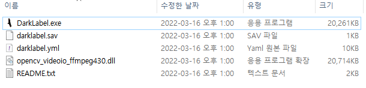

**Yolov5는 640 * 640 ì—ì„œ 지ì›í•˜ë¯€ë¡œ ì›ë³¸ì˜ìƒì„ í•´ìƒë„ 변환 프로그ë¨ì„ 
ì´ìš©í•˜ì—¬ 640 * 640 으로설정한다.**
(Since Yolov5 is supported by 640 * 640, the original image is set to 640 * 640 using a resolution conversion program.)

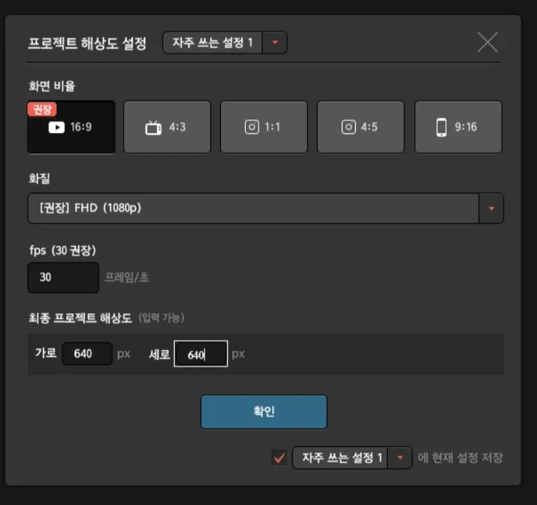

[[https://www.bing.com/ck/a?!&&p=17025025dbeef5d650a67a3b4a49c0218bed35529ef61e6ddbfc38d974981ab8JmltdHM9MTczMTYyODgwMA&ptn=3&ver=2&hsh=4&fclid=29425e80-95ec-62a3-2119-51b5944e63b9&psq=ë±ë¯¹ìŠ¤&u=a1aHR0cHM6Ly93d3cudmFwc2hpb24uY29tL3ZhcHNoaW9uMy9kb3dubG9hZC5waHA&ntb=1](https://www.bing.com/ck/a?!&&p=17025025dbeef5d650a67a3b4a49c0218bed35529ef61e6ddbfc38d974981ab8JmltdHM9MTczMTYyODgwMA&ptn=3&ver=2&hsh=4&fclid=29425e80-95ec-62a3-2119-51b5944e63b9&psq=%eb%b1%81%eb%af%b9%ec%8a%a4&u=a1aHR0cHM6Ly93d3cudmFwc2hpb24uY29tL3ZhcHNoaW9uMy9kb3dubG9hZC5waHA&ntb=1)](https://www.bing.com/ck/a?!&&p=17025025dbeef5d650a67a3b4a49c0218bed35529ef61e6ddbfc38d974981ab8JmltdHM9MTczMTYyODgwMA&ptn=3&ver=2&hsh=4&fclid=29425e80-95ec-62a3-2119-51b5944e63b9&psq=%eb%b1%81%eb%af%b9%ec%8a%a4&u=a1aHR0cHM6Ly93d3cudmFwc2hpb24uY29tL3ZhcHNoaW9uMy9kb3dubG9hZC5waHA&ntb=1)

[https://www.bing.com/ck/a?!&&p=17025025dbeef5d650a67a3b4a49c0218bed35529ef61e6ddbfc38d974981ab8JmltdHM9MTczMTYyODgwMA&ptn=3&ver=2&hsh=4&fclid=29425e80-95ec-62a3-2119-51b5944e63b9&psq=ë±ë¯¹ìŠ¤&u=a1aHR0cHM6Ly93d3cudmFwc2hpb24uY29tL3ZhcHNoaW9uMy9kb3dubG9hZC5waHA&ntb=1](https://www.bing.com/ck/a?!&&p=17025025dbeef5d650a67a3b4a49c0218bed35529ef61e6ddbfc38d974981ab8JmltdHM9MTczMTYyODgwMA&ptn=3&ver=2&hsh=4&fclid=29425e80-95ec-62a3-2119-51b5944e63b9&psq=%eb%b1%81%eb%af%b9%ec%8a%a4&u=a1aHR0cHM6Ly93d3cudmFwc2hpb24uY29tL3ZhcHNoaW9uMy9kb3dubG9hZC5waHA&ntb=1)

**darklabel.yaml 파ì¼ì„ í…스트 형ì‹ì´ë‚˜ VScode 와 ê°™ì€ ê°œë°œ 환경ì—ì„œ ì—´ì–´
classes_setì— ë³¸ì¸ì´ ë¼ë²¨ë§ í•  ê°ì²´ 즉, í´ë˜ìŠ¤ë“¤ì˜ ì´ë¦„ì„ ë¦¬ìŠ¤íŠ¸ 형ì‹ìœ¼ë¡œ ì‘성해준다.**

(Open the darklabel.yaml file in a development environment such as text format or VScode in classes_set, the names of the objects to be labeled, that is, classes, are written in the form of a list.)

```python
classes_set: "my_classes1"   # predefined classes set (tag name of classes set)
```

```python
my_classes1:  [ "YogaBlock", "Kettlebell","MedBall","FoamRoller","LacrosseBall", "AquaBall"]
```

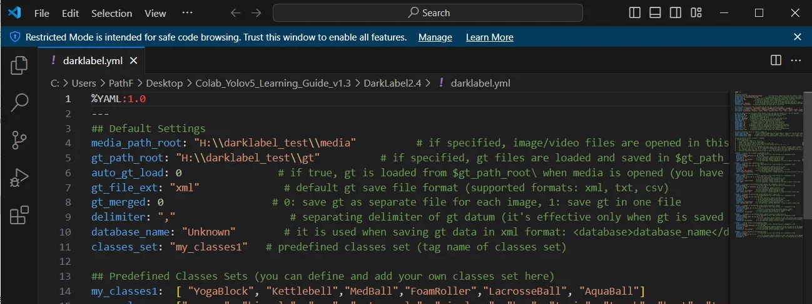

**VS 스튜디오ì—ì„œ 다ìŒê³¼ ê°™ì´ ì½”ë“œë¥¼ ì…력하면  Annotationí•  ë•Œ DarkLabel GUIì—ì„œ 설정한 classes를 ë³¼ 수 ìˆê²Œ classes_setì€ ë¯¸ë¦¬ 설정해 ë†“ì€ â€˜my_classes1’를 넣고 GUIì—ì„œ ë³¼ nameì„ â€™fitness_accessories’로 설정한다**

(In order to see the classes set in the DarkLabel GUI when announcing by entering the code as follows in VS Studio, class_set adds a preset 'my_classes1' and sets the name to be viewed in the GUI to 'fitness_accessories’)

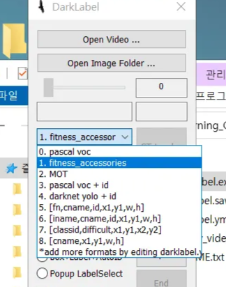

```python
format1:    # darknet yolo (predefined format]
  fixed_filetype: 1                 # if specified as true, save setting isn't changeable in GUI
  data_fmt: [classid, ncx, ncy, nw, nh]
  gt_file_ext: "txt"                 # if not specified, default setting is used
  gt_merged: 0                    # if not specified, default setting is used
  delimiter: " "                     # if not spedified, default delimiter(',') is used
  classes_set: "my_classes1"     # if not specified, default setting is used
  name: "fitness_accessories"           # if not specified, "[fmt%d] $data_fmt" is used as default format name

```

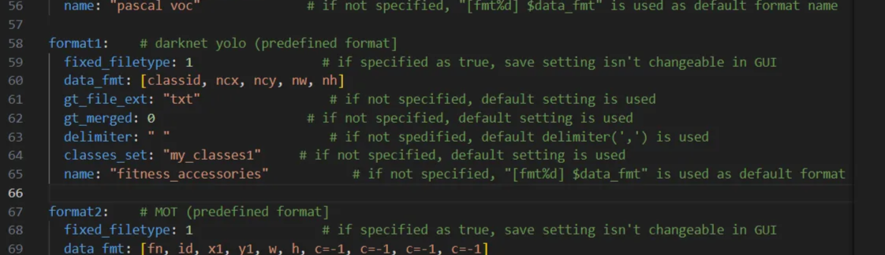

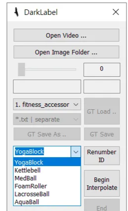

**다ìŒê³¼ ê°™ì´ ê°ì²´ë¥¼ ë¼ë²¨ë§í•  ëª…ì¹­ë“¤ì´ ë‚´ê°€ 설정한 í´ë˜ìŠ¤ì´ë¦„ê³¼ ê°™ì€ ê²ƒì„ GUIì—ì„œ 확ì¸í•  수 ìˆë‹¤
(You can check on the GUI that the names to label objects are the same as the class names I set)**

**Open Video 를 눌러 ë‚´ê°€ ë¼ë²¨ë§í•  ì›ë³¸ ì˜ìƒì„ 불러온다(Press Open Video to sing the original image to label)**

# ì˜ìƒì„ ì´ë¯¸ì§€ì™€ .txt파ì¼ë¡œ 추출하는 방법

---

**open video를 ì—´ì–´ 추출할 ì˜ìƒì„ ì„ íƒ í•´ì¤€ë‹¤.**

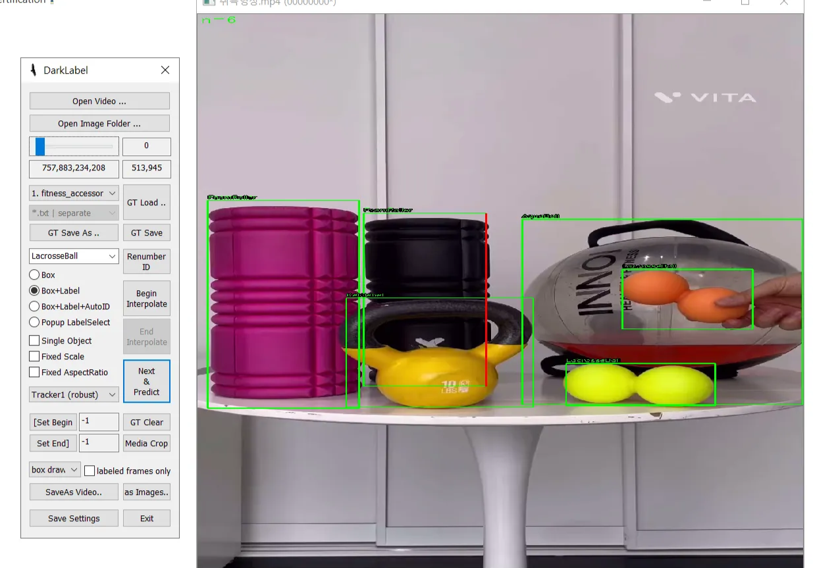

**ì˜ìƒì„ ì—´ê³  추출할 ì´ë¯¸ì§€ë¥¼ ì €ì¥í•  í´ë”를 반드시 만들고 만든 í´ë”ì— images í´ë”를 ë” ë§Œë“¤ì–´ innotation ëœ .txt파ì¼ê³¼ 구별해준다.**
(Make sure you open the video and create a folder to store the image you want to extract and create more images folders in the folder you created to distinguish it from the notated .txt file.)

**Box + Label ì„ ì²´í¬í•´ì£¼ê³  ê° ì†Œë„êµ¬ì˜ ëª…ì¹­ì— ë§ê²Œ ë¼ë²¨ë§ì„ í•´ì¤ë‹ˆë‹¤
ë¼ë²¨ë§ì‹œì—는 Box + Labelì„ ì„ íƒí•˜ì—¬ ë¼ë²¨ë§ì‹œì— í™”ë©´ì„ êµ¬ë¶„í•˜ëŠ” ìš©ë„ì´ë‹¤.
(**Check the box + label and label it according to the name of each accessory
When labeling, Box + Label is selected to distinguish the screen during labeling.)

**ë¼ë²¨ë§ì„ ëª¨ë‘ ì§„í–‰í•œ 후 미리 ì €ì¥í•œ í´ë” images í´ë”ì— as Images ë²„íŠ¼ì„ ëˆŒëŸ¬ ì´ë¯¸ì§€ 형태로 ì €ì¥í•´ì¤€ë‹¤.**
(After all labeling, press the as images button in the pre-saved folder images folder to save it in the form of an image.)

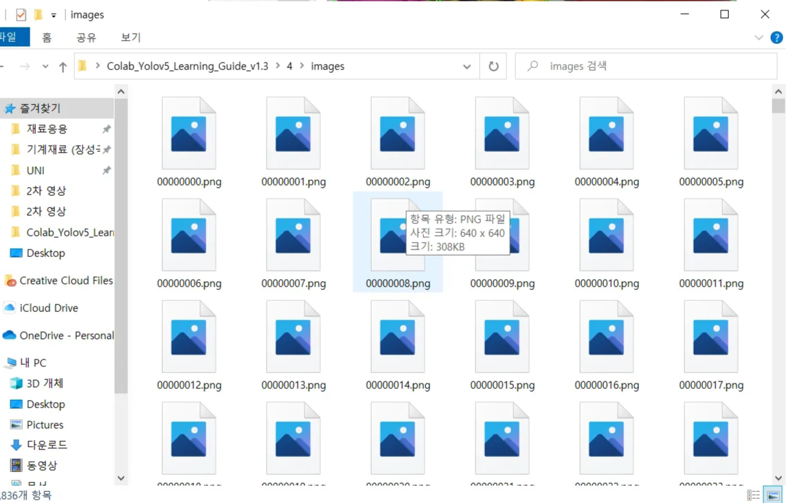

**ì´ë¯¸ì§€ 형태로 ì €ì¥ì„ 완료한 í›„ì— save as GT ë²„íŠ¼ì„ ëˆŒëŸ¬ images í´ë”와 구분ë˜ê²Œ ì €ì¥í•´ì¤€ë‹¤.ì´ëŸ° 구분 ì‘ì—…ì€ ì´í›„ì— colabì— ë„£ì„ ë•Œ 훨씬 ë” í¸ë¦¬í•˜ë‹¤.**
(After you complete the save in image format, press the save as GT button to save it distinct from the images folder. This distinction is much more convenient when you put it in the colab later.)

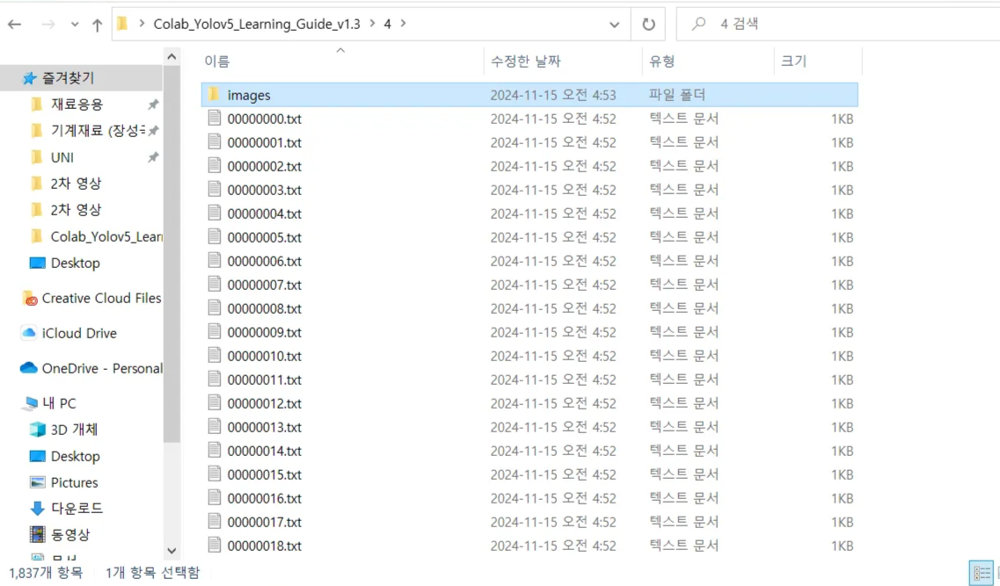

# Colabì„ ì´ìš©í•œ Yolov5 학습
(Learning Yolov5 with Colab)

---

### **1. Colabì— ì ‘ì†í•˜ì—¬ ë° êµ¬ê¸€ ë“œë¼ì´ë¸Œì™€ 연결하여 하위 í´ë” ìƒì„±**
   (Connect to Colab and connect to Google Drive to create     
     subfolders)

```python
# prompt: 구글 ë“œë¼ì´ë¸Œë‘ ì—°ê²°

from google.colab import drive
drive.flush_and_unmount()  # 기존 마운트 해제
drive.mount('/content/drive')  # 다시 마운트
```

```python
%cd /content/drive/MyDri
```

```python
# prompt: 구글 ë“œë¼ì´ë¸Œë‘ ì—°ê²°

from google.colab import drive
drive.flush_and_unmount()  # 기존 마운트 해제
drive.mount('/content/drive')  # 다시 마운트
```

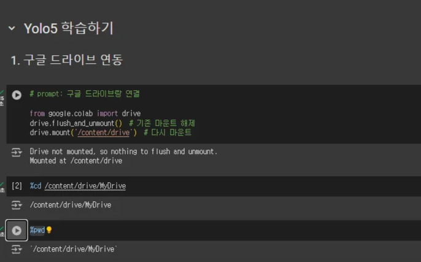

---

### **2. YOLOv5 다운로드
(Download YOLOv5)**

```python
##
#clone YOLOv5 and
!git clone https://github.com/ultralytics/yolov5  # clone repo
%cd yolov5
%pip install -qr requirements.txt # install dependencies
```

```python
!pip install Pillow==10.3
```

 **YOLOv5ì—ì„œ pythonì„ ì“°ëŠ”ë° Python íŒ¨í‚¤ì§€ë“¤ì„ ì‰½ê²Œ 설치, 관리할 수 ìˆê²Œ 해주는 ë„êµ¬ì¸ pip와 ì´ë¯¸ì§€ 처리를 담당하는 Pillowë¼ì´ë¸ŒëŸ¬ë¦¬ë¥¼ 다운로드 한다.**
(YOLOv5 downloads pip, a tool that makes it easy to install and manage Python packages, and Pillow Library, which is responsible for image processing.)
****

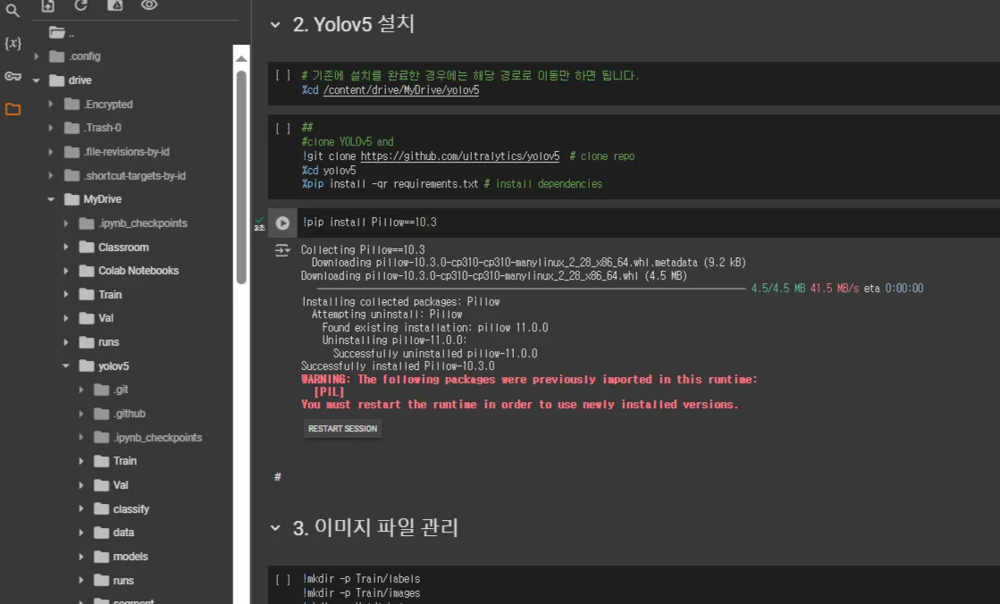

---

### **3. ì´ë¯¸ì§€ 파ì¼ë“¤ì„ 관리 í´ë” ìƒì„±**
(Create a management folder for image files)
****

```python
!mkdir -p Train/labels
!mkdir -p Train/images
!mkdir -p Val/labels
!mkdir -p Val/images
%pw
```

```python
##ê²€ì¦ ë°ì´í„° 만들기
import os
import shutil
from sklearn.model_selection import %pwdtrain_test_split

def create_validation_set(train_path, val_path, split_ratio=0.3):
    """
    Train ë°ì´í„°ì˜ ì¼ë¶€ë¥¼ Valë¡œ ì´ë™
    """
    # 필요한 디렉토리 ìƒì„±
    os.makedirs(os.path.join(val_path, 'images'), exist_ok=True)
    os.makedirs(os.path.join(val_path, 'labels'), exist_ok=True)

    # Train ì´ë¯¸ì§€ 리스트 가져오기
    train_images = os.listdir(os.path.join(train_path, 'images'))
    train_images = [f for f in train_images if f.endswith(('.jpg', '.jpeg', '.png'))]

    # Train/Val 분할
    _, val_images = train_test_split(train_images,
                                   test_size=split_ratio,
                                   random_state=42)

    # Valë¡œ íŒŒì¼ ë³µì‚¬
    for image_file in val_images:
        # ì´ë¯¸ì§€ 복사
        src_image = os.path.join(train_path, 'images', image_file)
        dst_image = os.path.join(val_path, 'images', image_file)
        shutil.copy2(src_image, dst_image)

        # ë¼ë²¨ íŒŒì¼ ë³µì‚¬
        label_file = os.path.splitext(image_file)[0] + '.txt'
        src_label = os.path.join(train_path, 'labels', label_file)
        dst_label = os.path.join(val_path, 'labels', label_file)
        if os.path.exists(src_label):
            shutil.copy2(src_label, dst_label)

    print(f"Created validation set with {len(val_images)} images")

# 실행
train_path = '/content/drive/MyDrive/yolov5/Train'
val_path = '/content/drive/MyDrive/yolov5/Val'

create_validation_set(train_path, val_path)
```

**Train ë°ì´í„°ì—ì„œ ì§€ì •ëœ ë¹„ìœ¨ë§Œí¼ ì´ë¯¸ì§€ë¥¼ 추출해 Validation ë°ì´í„°ë¡œ 분리 ë° ë³µì‚¬í•˜ê³  ì´ë¯¸ì§€ì™€ 함께 ë¼ë²¨ 파ì¼ë„ 해당 경로로 복사하여 Validation ë°ì´í„°ì…‹ì„ 구성한다. í•´ë‹¹ì½”ë“œì˜ ê¸°ëŠ¥ì€ ë‹¤ìŒê³¼ 같다.**
(The validation dataset is composed by extracting images from the training data at a specified rate, separating and copying them into validation data, and copying the label file along with the image to the corresponding path. The functions of the code are as follows.)
****

- **모ë¸ì˜ 성능 í‰ê°€(Evaluation of the performance of the model)**
    - Validation ë°ì´í„°ëŠ” 모ë¸ì´ 학습하지 ì•Šì€ ë°ì´í„°ë¡œ, 모ë¸ì˜ ì¼ë°˜í™” 성능(새로운 ë°ì´í„°ì— 얼마나 ì˜ ì‘ë™í•˜ëŠ”지를 í‰ê°€í•˜ê¸° 위해 í•„ìš”
    (Validation data is data that the model has not learned, and is needed to evaluate the generalization performance of the model (how well it works on new data))
- **ë°ì´í„° í¸í–¥ 방지(data bias prevention)**
    - 학습(Train) ë°ì´í„°ë§Œ 사용하면 모ë¸ì´ ë°ì´í„°ì— ê³¼ì í•©(Overfitting)ë  ê°€ëŠ¥ì„±ì´ ë†’ë‹¤.
    (Using only the training data is likely to overfit the model to the data.)
    - Validation ë°ì´í„°ë¥¼ 통해 모ë¸ì´ 다양한 ë°ì´í„°ì— 대해 균형 ì¡íŒ ì„±ëŠ¥ì„ ê°€ì§€ë„ë¡ í™•ì¸í•  수 ìˆìŒ
    (You can check the model to have balanced performance for various data)
- **하ì´í¼íŒŒë¼ë¯¸í„° 튜ë‹(Hyperparameter tuning)**
    - 학습 ë„중 학습률, epoch 수, ëª¨ë¸ êµ¬ì¡° 등 하ì´í¼íŒŒë¼ë¯¸í„°ë¥¼ ì¡°ì •í•  ë•Œ Validation ë°ì´í„°ì˜ 결과를 참고하고 Validation ì„±ëŠ¥ì´ ë†’ì•„ì§€ëŠ” 방향으로 하ì´í¼íŒŒë¼ë¯¸í„°ë¥¼ 최ì í™”한다.
    (When adjusting hyperparameters such as learning rate, number of epochs, and model structure during learning, refer to the results of validation data and optimize the hyperparameters in the direction of increasing validation performance.)
    

**Validation ë°ì´í„°ë¥¼ 분리하는 ê²ƒì€ ëª¨ë¸ì˜ 성능 í‰ê°€ì™€ ê°œì„ ì„ ìœ„í•œ 필수 과정ì´ë‹¤.**
(Isolation of validation data is an essential process for performance evaluation and improvement of the model.)

```python
def check_dataset():
    train_path = '/content/drive/MyDrive/yolov5/Train'
    val_path = '/content/drive/MyDrive/yolov5/Val'

    # Train ë°ì´í„° 확ì¸
    train_images = len(os.listdir(os.path.join(train_path, 'images')))
    train_labels = len(os.listdir(os.path.join(train_path, 'labels')))

    # Val ë°ì´í„° 확ì¸
    val_images = len(os.listdir(os.path.join(val_path, 'images')))
    val_labels = len(os.listdir(os.path.join(val_path, 'labels')))

    print("Dataset status:")
    print(f"Train - Images: {train_images}, Labels: {train_labels}")
    print(f"Val - Images: {val_images}, Labels: {val_labels}")

# ë°ì´í„°ì…‹ ìƒíƒœ 확ì¸
check_dataset()
```

![ë°ì´í„°ì…‹ì˜ í¬ê¸°ê°€ 다ìŒê³¼ ê°™ì´ ëª‡ì‹­ì—ì„œ ëª‡ë°±ì¥ ì²˜ëŸ¼ í° ì°¨ì´ê°€ì—†ì„ ì •ë„ë¡œ ì°¨ì´ê°€ 나면 ì´í›„ì— í•™ìŠµì‹œí‚¤ëŠ” ë° í° ë¬¸ì œê°€ 없다. 정확ë„ê°€ 미미하게 떨어지겠지만 í˜„ì¬ ì›ë³¸ ì´ë¯¸ì§€ìˆ˜ì—는 유ì˜ë¯¸í• ì •ë„ì˜ ì˜í–¥ì„ 미치지 ì•ŠìŒ.
(If the size of the dataset differs to the extent that there is no significant difference between a few tens and a few hundred chapters as follows, there is no big problem in learning afterwards. The accuracy will be slightly lowered, but it does not significantly affect the current number of original images.)](295dd344-e5a3-4219-adb7-5f1338aa46e0.png)

ë°ì´í„°ì…‹ì˜ í¬ê¸°ê°€ 다ìŒê³¼ ê°™ì´ ëª‡ì‹­ì—ì„œ ëª‡ë°±ì¥ ì²˜ëŸ¼ í° ì°¨ì´ê°€ì—†ì„ ì •ë„ë¡œ ì°¨ì´ê°€ 나면 ì´í›„ì— í•™ìŠµì‹œí‚¤ëŠ” ë° í° ë¬¸ì œê°€ 없다. 정확ë„ê°€ 미미하게 떨어지겠지만 í˜„ì¬ ì›ë³¸ ì´ë¯¸ì§€ìˆ˜ì—는 유ì˜ë¯¸í• ì •ë„ì˜ ì˜í–¥ì„ 미치지 ì•ŠìŒ.
(If the size of the dataset differs to the extent that there is no significant difference between a few tens and a few hundred chapters as follows, there is no big problem in learning afterwards. The accuracy will be slightly lowered, but it does not significantly affect the current number of original images.)

---

### **4. 학습시ì‘
(Start learning)**

```python
import torch
import os
from IPython.display import Image, clear_output  # to display images
```

```python
%pwd
```

**import os :  ìš´ì˜ì²´ì œì™€ ìƒí˜¸ì‘용하기 위한 OS**
(OS for interacting with the operating system)

**import torch** : **ë”¥ëŸ¬ë‹ ëª¨ë¸ì„ 구축하고 학습시키기 위해 사용ë˜ê³  
ë”¥ëŸ¬ë‹ ëª¨ë¸ í•™ìŠµ, 추론, í…ì„œ ì—°ì‚° ë“±ì— í™œìš©ë˜ëŠ” pytorchë¼ì´ë¸ŒëŸ¬ë¦¬**

(It is used to build and train deep learning models
Pytorch library used for deep learning model training, inference, and tensor operations)

```python
import numpy as np
import tensorflow as tf
import os
from PIL import Image
from tensorflow.python.eager.context import eager_mode

def _preproc(image, output_height=512, output_width=512, resize_side=512):
    ''' imagenet-standard: aspect-preserving resize to 256px smaller-side, then central-crop to 224px'''
    with eager_mode():
        h, w = image.shape[0], image.shape[1]
        scale = tf.cond(tf.less(h, w), lambda: resize_side / h, lambda: resize_side / w)
        resized_image = tf.compat.v1.image.resize_bilinear(tf.expand_dims(image, 0), [int(h*scale), int(w*scale)])
        cropped_image = tf.compat.v1.image.resize_with_crop_or_pad(resized_image, output_height, output_width)
        return tf.squeeze(cropped_image)

def Create_npy(imagespath, imgsize, ext) :
    images_list = [img_name for img_name in os.listdir(imagespath) if
                os.path.splitext(img_name)[1].lower() == '.'+ext.lower()]
    calib_dataset = np.zeros((len(images_list), imgsize, imgsize, 3), dtype=np.float32)

    for idx, img_name in enumerate(sorted(images_list)):
        img_path = os.path.join(imagespath, img_name)
        try:
            # íŒŒì¼ í¬ê¸°ê°€ ì •ìƒì ì¸ì§€ 확ì¸
            if os.path.getsize(img_path) == 0:
                print(f"Error: {img_path} is empty.")
                continue

            img = Image.open(img_path)
            img = img.convert("RGB")  # RGBA ì´ë¯¸ì§€ 등 다른 형ì‹ì´ ìˆì„ 경우 강제로 RGBë¡œ 변환
            img_np = np.array(img)

            img_preproc = _preproc(img_np, imgsize, imgsize, imgsize)
            calib_dataset[idx,:,:,:] = img_preproc.numpy().astype(np.uint8)
            print(f"Processed image {img_path}")

        except Exception as e:
            print(f"Error processing image {img_path}: {e}")

    np.save('calib_set.npy', calib_dataset)
```

**ì´ ì½”ë“œëŠ” ì§€ì •ëœ í´ë”ì˜ ì´ë¯¸ì§€ë¥¼ ì½ì–´ë“¤ì—¬,비율 유지 리사ì´ì¦ˆì™€ 
중앙 í¬ë¡­/패딩으로 전처리한 후 Numpy ë°°ì—´ë¡œ ì €ì¥í•œë‹¤.**

**ì „ì²˜ë¦¬ëœ ë°ì´í„°ëŠ”**.npy**파ì¼ë¡œ ì €ì¥ë˜ì–´ ëª¨ë¸ í•™ìŠµ ë˜ëŠ” êµì • ë°ì´í„°ë¡œ 활용ëœë‹¤.**

(This code reads the image of the specified folder, contains the ratio maintenance resize and Pretreatment with center crop/padding and save in a Numpy array. The preprocessed data is stored as a .npy file and used as model training or calibration data.)

```python
#ëª¨ë¸ í•™ìŠµí•˜ê¸°
!python  /content/drive/MyDrive/yolov5/train.py  --img 640 --batch 16 --epochs 300 --data /content/drive/MyDrive/yolov5/data.yaml --weights yolov5n.pt --cache --patience 0  

```

**YOLOv5를 실행시키기위한 
`train.py`를 실행한다. 다양한 ì˜µì…˜ì´ í¬í•¨ë˜ì–´ ìˆëŠ”ë° ë‹¤ìŒê³¼ 같다.**

(YOLOv5를 실행시키기위한
train.py를 실행한다. 다양한 ì˜µì…˜ì´ í¬í•¨ë˜ì–´ ìˆëŠ”ë° ë‹¤ìŒê³¼ 같다.)

- **`--img 640`:**
    
    **ì…ë ¥ ì´ë¯¸ì§€ì˜ í¬ê¸°ë¥¼  640x640으로 설정한다.(**Set the size of the input image to 640x640.)
    
- **`--batch 16`:**
    
     **배치 í¬ê¸°ë¥¼ 설정한다. í•œ ë²ˆì— ì²˜ë¦¬ë˜ëŠ” ì´ë¯¸ì§€ì˜ 수를 나타낸다.
    (**Set the batch size. Indicates the number of images processed at a time.)
    
- **`--epochs 300`:**
    
     **학습 반복 횟수 ì—í­(epoch) 수를 설정합니다.
    (** Sets the total number of epochs to learn.)
    
- **`--data /content/drive/MyDrive/yolov5/data.yaml`**
    
    **ë°ì´í„°ì…‹ ë° ëª¨ë¸ êµ¬ì„±ì— ëŒ€í•œ ì„¤ì •ì´ ë‹´ê¸´ YAML 파ì¼ì˜ 경로를 지정한다.**
    Specify the path to the YAML file containing settings for the dataset and model configurations.)
    
- **`--weights yolov5n.pt`:**
    
    **미리 í›ˆë ¨ëœ ê°€ì¤‘ì¹˜ 파ì¼ì˜ 경로를 지정한다. yolov5ì—서는 `yolov5n.pt` 파ì¼ì„ 사용하고 ìˆë‹¤.
    (** Specify the path to pre-trained weight files. **`yolov5n.pt `** files are being used here.)
    
- **`--patience 0` :**
    
    **í•™ìŠµì´ ì¤‘ê°„ì— ë©ˆì¶”ëŠ”ê±¸ 방지해준다. 10으로 설정하면 10ë™ì•ˆ epochê°€ 변화가 없으면 정지한다.**(It prevents learning from stopping in the middle. Set to 10, if the epoch remains unchanged for 10 years, it stops.)
    
    ---
    
    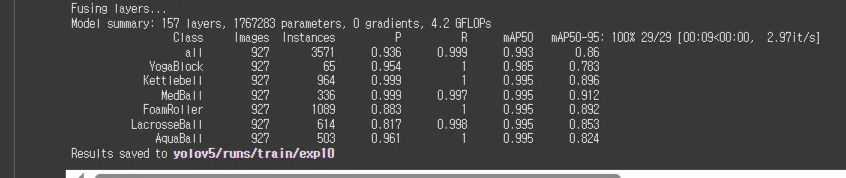
    
    **í•™ìŠµì´ ì™„ë£Œë˜ë©´ yolov5/runs/train/exp10 ì˜ ê²½ë¡œì— ê²°ê³¼ê°€ ì €ì¥ë˜ì—ˆë‹¤ëŠ” 문구를 ë³¼ 수 ìˆë‹¤.**
    
    ---
    
    ### **5.  yolov5ëª¨ë¸ í•™ìŠµ ê²°ê³¼ ê²€ì¦**
    
    ```python
    %load_ext tensorboard
    %tensorboard --logdir /content/drive/MyDrive/yolov5/runs/train/exp10
    ```
    
    **ìœ„ì˜ ì½”ë“œë¥¼ ì´ìš©í•˜ì—¬ --logdir /content/drive/MyDrive/yolov5/runs/train/exp10와 ê°™ì´ í•™ìŠµí•œ 경로를ë¼ë²¨ë¦¬ 지정하고 í…서보드를 ì´ìš©í•˜ì—¬ ì‹œê°í™” í•  수 ìˆë‹¤.**
    

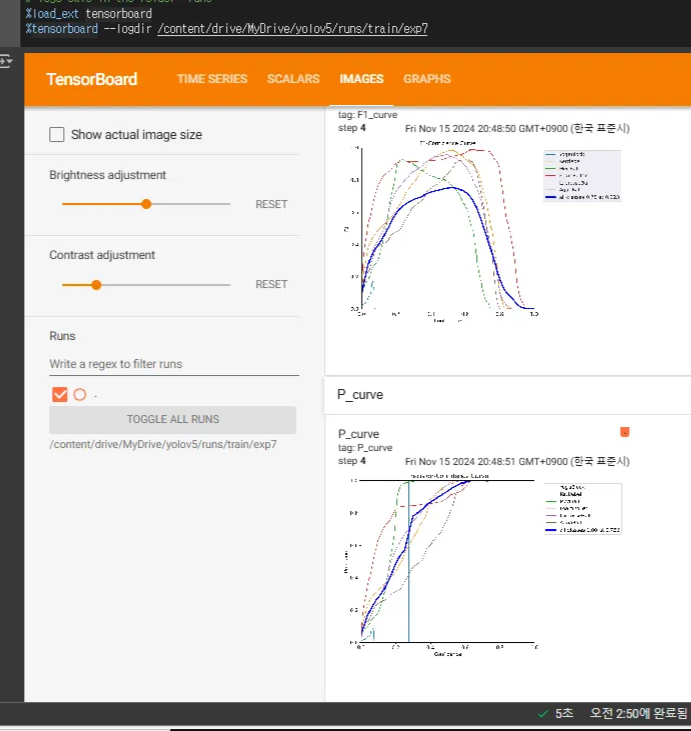

**학습한 ìë£Œë“¤ì„ ë°”íƒ•ìœ¼ë¡œ ë¼ë²¨ë§ëœ 해당 ê°ì²´ê°€ 다른 ì˜ìƒì´ë‚˜ ì´ë¯¸ì§€ì— 나오는 ê²ƒì„ ì¬í•™ìŠµí•˜ì—¬ ê²€ì¦í•˜ëŠ” 코드는 다ìŒê³¼ 같다.** 
(The code for re-learning and verifying that the object labeled based on the learned materials appears in other images or images is as follows.)

```python
!python /content/drive/MyDrive/yolov5/detect.py --weights /content/drive/MyDrive/yolov5/runs/train/exp4/weights/best.pt --img 640 --conf 0.1 --source /content/drive/MyDrive/yolov5/Train/images
```

```python
!python /content/drive/MyDrive/yolov5/detect.py --weights /content/drive/MyDrive/yolov5/runs/train/exp5/weights/best.pt --img 640 --conf 0.1 --source /content/drive/MyDrive/yolov5/Train/ë¼ìˆ.mp4
```

# **학습 결과물
(The results of learning)**

**학습 ëŒë¦° ë¼ë²¨ 결과물 train_batch**

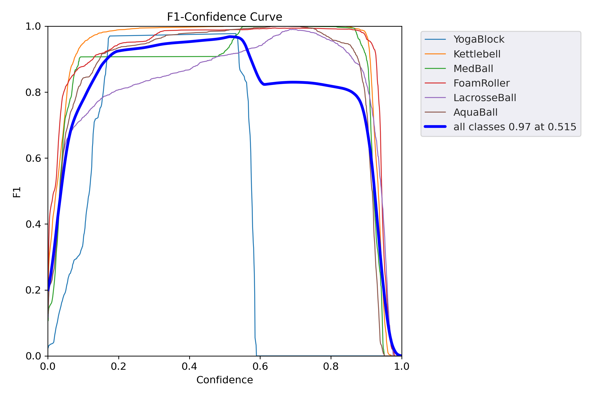

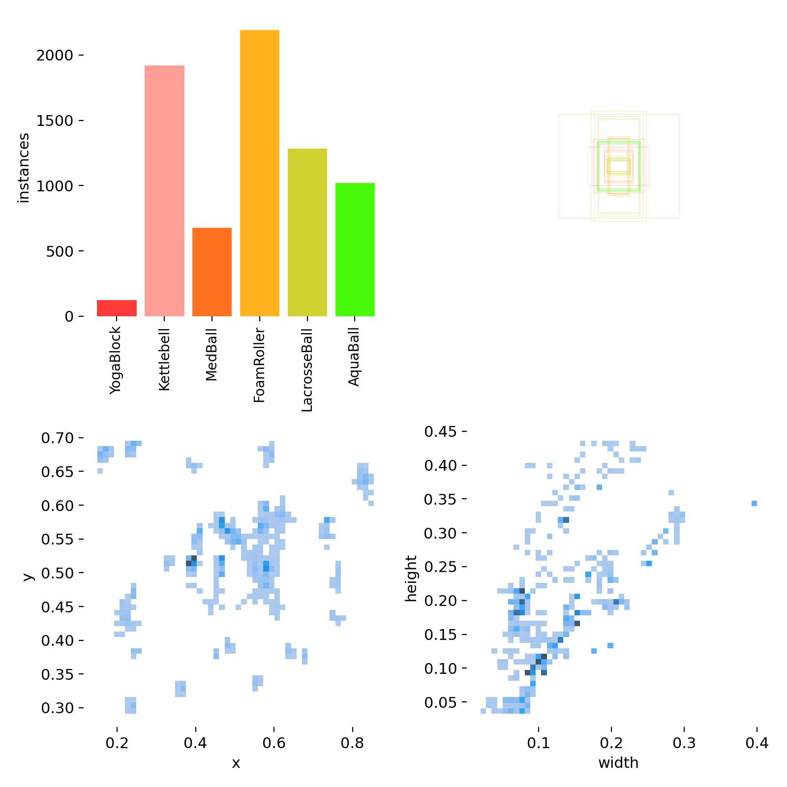

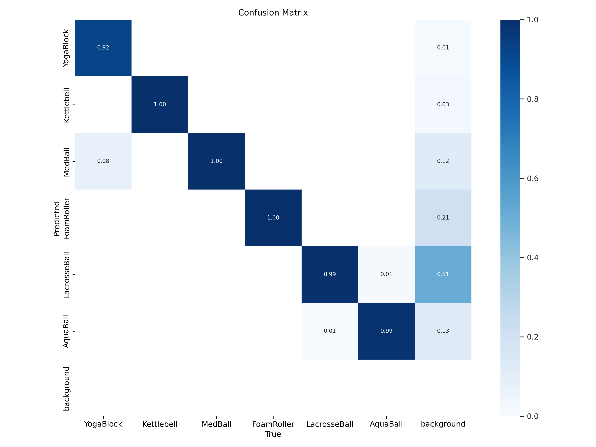

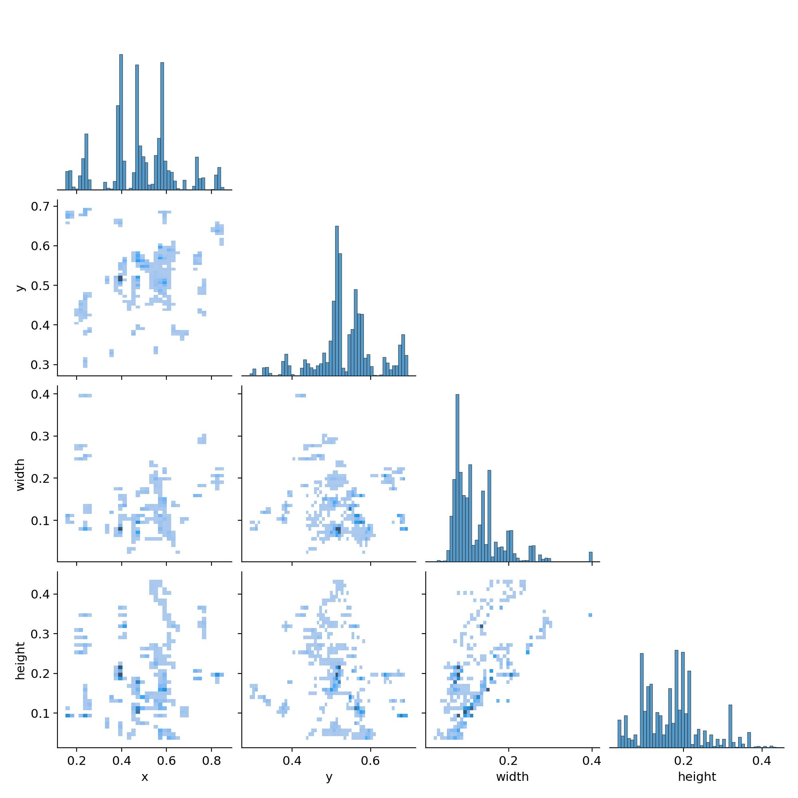

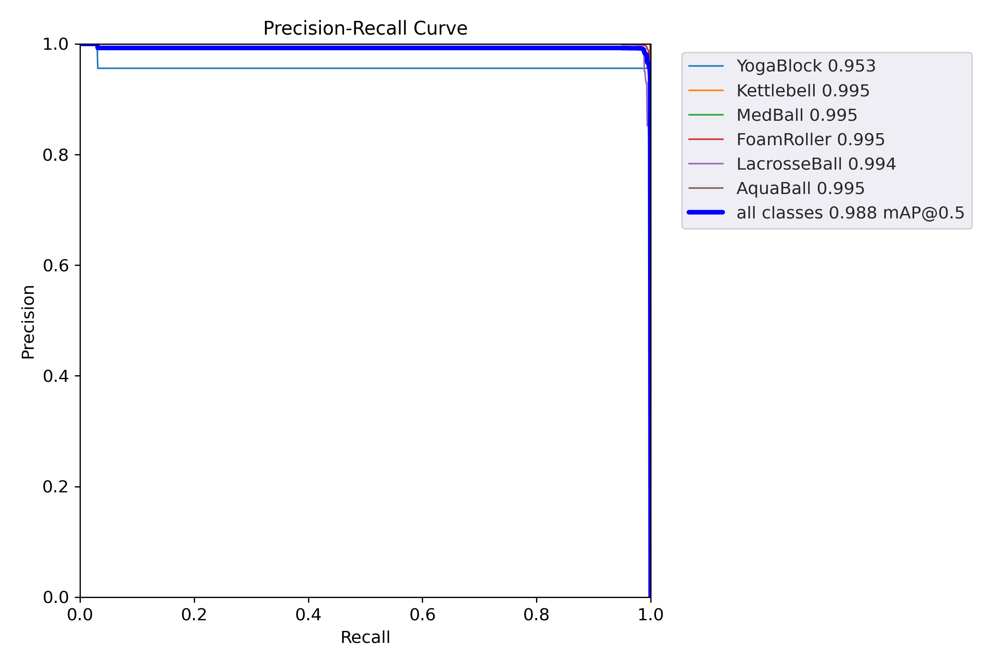

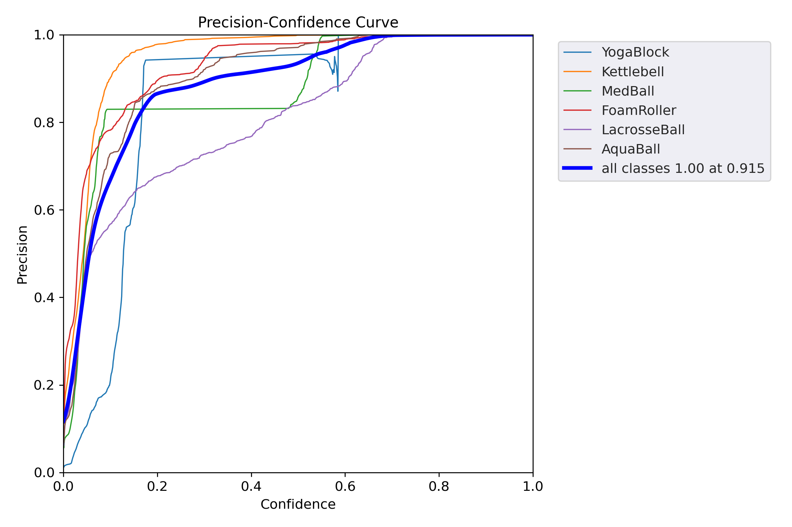

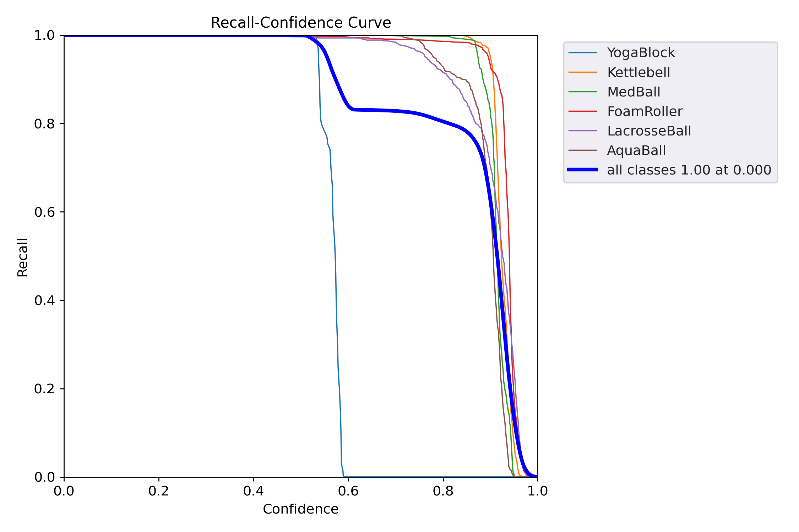

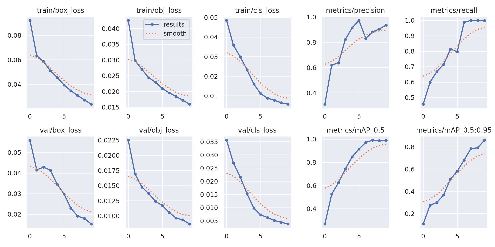

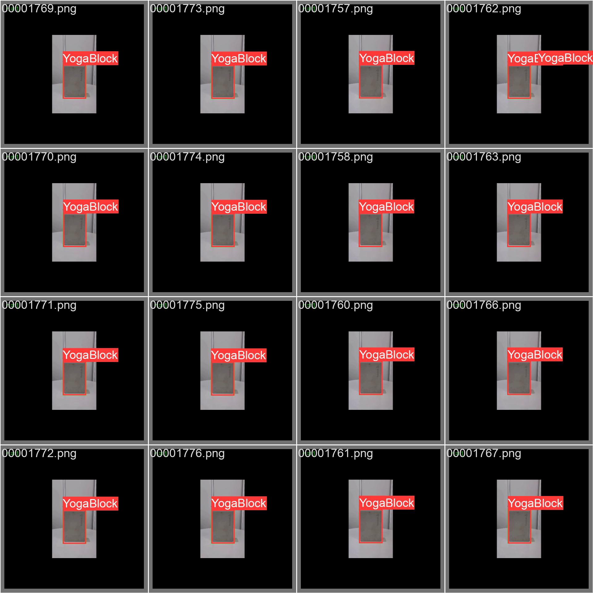

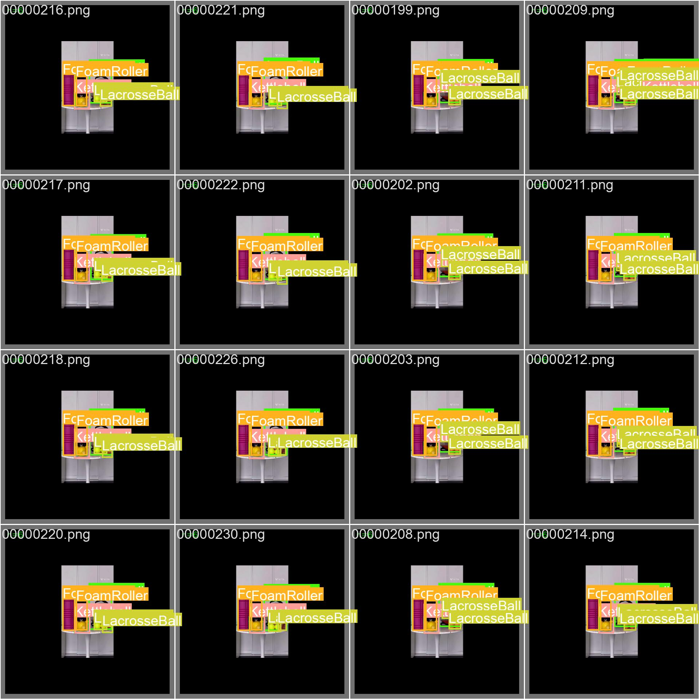

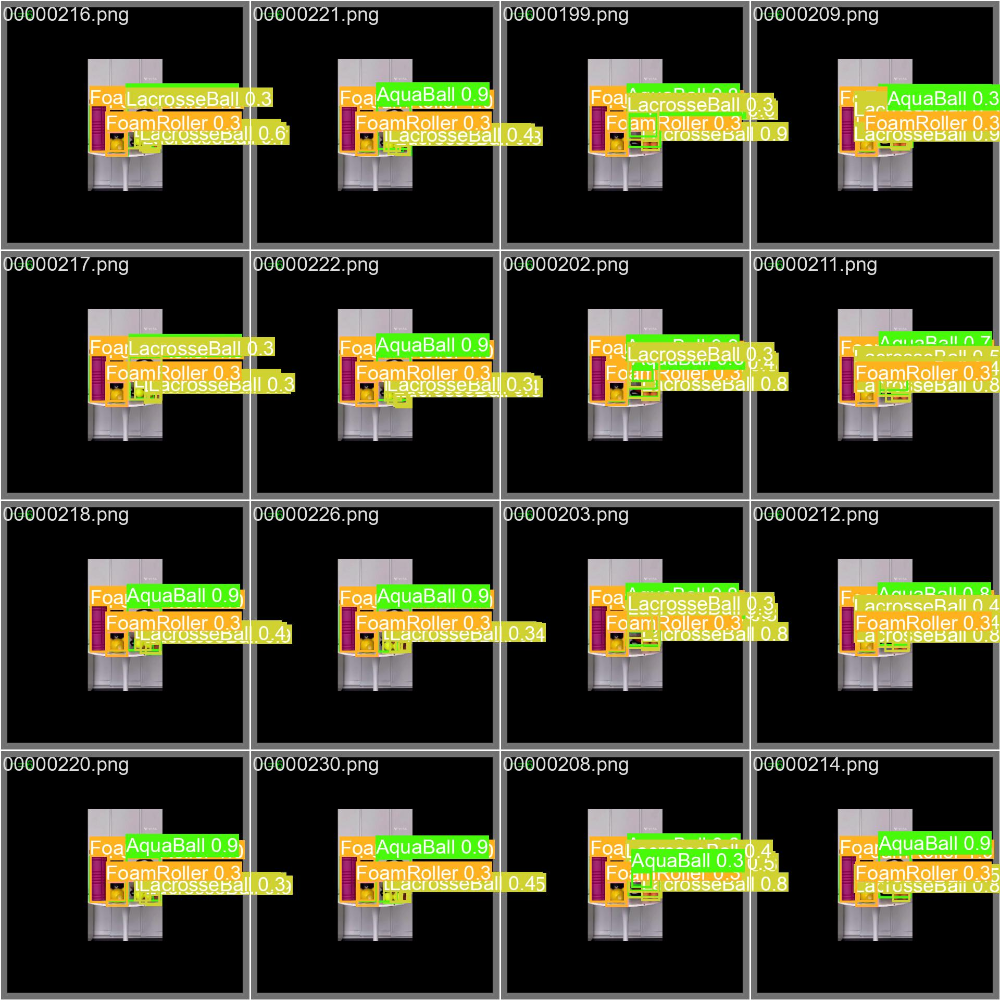

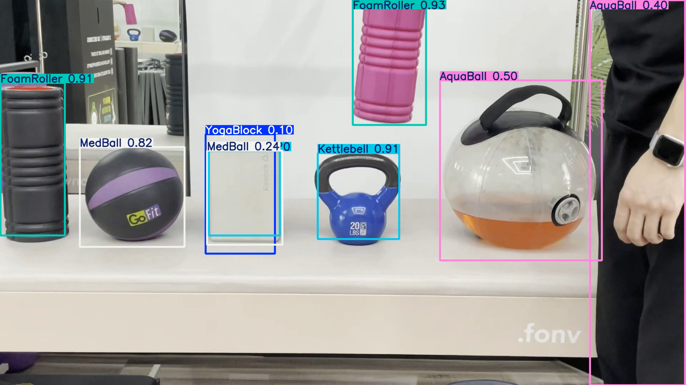

# **학습결과 ì˜ìƒ
(Learning Results Video)**

[https://youtu.be/yWuiWQbhLDA?si=vcco28nqa3DvEiR3](https://youtu.be/yWuiWQbhLDA?si=vcco28nqa3DvEiR3)

---

[https://youtube.com/shorts/7mulq1dcq00?si=3GKYVtTEMI6OMfBT](https://youtube.com/shorts/7mulq1dcq00?si=3GKYVtTEMI6OMfBT)

---

[https://youtu.be/xB4_d9nBZXw?si=Lv8a9Qi-PQ2SNWN4](https://youtu.be/xB4_d9nBZXw?si=Lv8a9Qi-PQ2SNWN4)

---

[https://youtube.com/shorts/riOYFq0lBrA?si=aCtcZegWiGhgOptZ](https://youtube.com/shorts/riOYFq0lBrA?si=aCtcZegWiGhgOptZ)

---

[https://youtu.be/31t7jyiUw3I?si=IIRwK7cRcrfU0K1E](https://youtu.be/31t7jyiUw3I?si=IIRwK7cRcrfU0K1E)

---

[https://youtu.be/50bJGmlF54Q?si=KXy3Aq4l-5f_SBgm](https://youtu.be/50bJGmlF54Q?si=KXy3Aq4l-5f_SBgm)

[https://drive.google.com/drive/folders/1eQhV7VjYvbUjdPRBkt-Feh6n9A50mIaH?usp=drive_link](https://drive.google.com/drive/folders/1eQhV7VjYvbUjdPRBkt-Feh6n9A50mIaH?usp=drive_link)